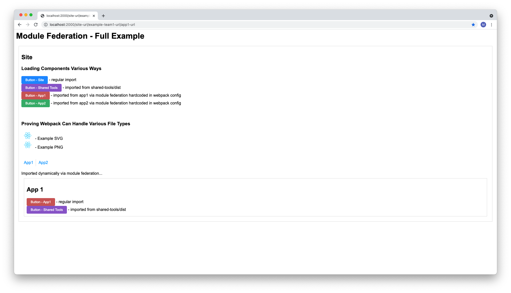

# experiments-module-federation-examples-v2

A "fully featured" Module Federation example that simulates multiple teams working together to
easily produce a single app. This is a fully working micro frontend architecture.

## Folder Structure

This project is meant to mimic a department of teams working on a single app. Here is a simplified
version of the folder structure that is important to conceptually understand this project

- teams
  1. core-team
     - shared-tools
     - site
  2. devops-team
     - dev-mock
  3. example-team1
     - app1
     - app2
- (In real life, each team would have their own repo, but for demo purposes, this project is one
  repo.)

## Features

- **Module Federation**  
  Module Federation allows teams to build and deploy code separately. Other teams import their work
  dynamically at runtime.

  This project expands on the official TypeScript and dynamic hosts examples

  - https://github.com/module-federation/module-federation-examples/tree/master/dynamic-system-host
  - https://github.com/module-federation/module-federation-examples/tree/master/typescript

- **Local Proxy Router and Mock Dev Environment**  
  It's best if each team works in a local environment that is as realistic as possible.

  Each team has a local proxy router. The team's code is served from the localhosts they are
  running, but everything else is proxied from the dev environment. This allows them to iterate on
  their own code against the latest code from other teams.

  As soon as a team deploys to dev, all other teams will automatically start working with their
  latest work. In this way, teams work independently but are always working with a complete copy of
  the site.

  See each team's config.mattfin-local-router.js file and /teams/devops-team/packages/dev-mock

- **Tools**  
  Tools are provided to teams to make work easier. Instead of each team needing to configure Webpack
  for each of their packages, they are managed centrally in /teams/core-team/shared-tools/src/bin

  - **mattfin-pack**  
    Equivalent to webpack build and webpack serve. See mattfin-pack.js and each package's
    config.mattfin-pack.js
  - **mattfin-serve**  
    Runs the local proxy router for each team so they can work on their own code against the latest
    from other teams

- **Easy workflow**  
  Working with this architecture is incredibly easy.

  - Each team works on their own code against a full site with the latest copies of other team's
    code.
  - Deploying to different environments would be incredibly easy. It could be set up so that each
    team has a dev, qa, and prod branch. A timer could be run every X minutes to deploy each team's
    dev branch to the dev environment, qa to qa, prod to prod.
  - Each team has control over their own definitions for their navigation items and their
    dynamically loaded apps. No need to ask the site team to review and merge changes. (See
    nav-and-component-definitions.json)

- **Webpack**  
  Webpack has been configured to support the following
  - Images and fonts
  - Typed CSS modules. Global CSS is prevented with CSS modules. Type checking of CSS classes is
    done with TypeScript
  - (If used in production, some work should be done on minification, etc)

---

## Prerequisites

- Node v12+
- Yarn 1.22+

## Set Up

Thanks to Lerna and Yarn workspaces, you only need to run one install command

- In the root of the project, run
  ```
  yarn install
  ```

## Run

- Run the following from the root of the project to ensure dev-mock has files to serve. Lerna will
  build all the packages in the order they need to be built.
  ```
  yarn run clean && yarn run build
  ```
  You can "redeploy" the latest to the mock dev environment at any time by running the command
  again.
- Run the following to continously compile and serve code on localhost
  ```
  yarn start
  ```
- Open your browser to the following
  1. core-team's local: http://localhost:1000
  2. example-team1's local: http://localhost:1100
  3. mock dev environment: http://localhost:2000
- Try it out!
  - Make a text change to `site/~/app.tsx` and `app1/~/app.tsx`.
  - Notice the changes are kept separate on URL's 1 and 2 above and not available in 3.
  - Run build. After it is done, all 3 URLs will pick up both sets of changes.
- Although they won't be fully functional, it is interesting to know you can also open the following
  - core-team
    - site: http://localhost:1002/assets/core-team\_\_site/
  - example-team1
    - definitions: http://localhost:1103/assets/example-team1\_\_definitions/definitions.json
    - app1: http://localhost:1101/assets/example-team1\_\_app1/
    - app2: http://localhost:1102/assets/example-team1\_\_app2/

## Other Commands

- From the root, you can also run the following to format the code with Prettier and Stylelint
  ```
  yarn run format
  ```

## Screenshot

